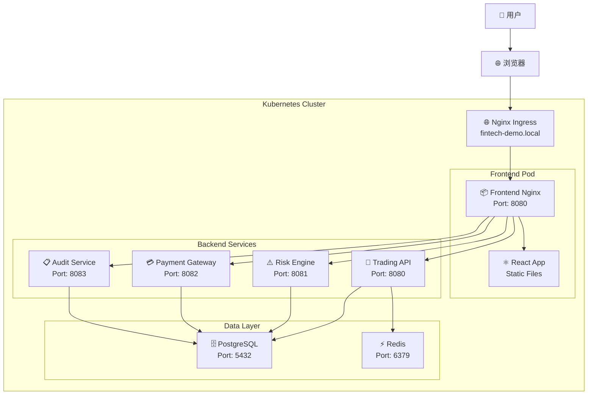
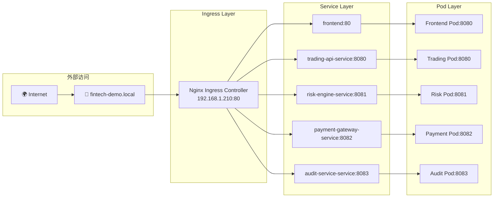

# FinTech eBPF Demo - 架构指南

## 📋 目录
- [系统架构概览](#系统架构概览)
- [组件关系图](#组件关系图)
- [请求流程详解](#请求流程详解)
- [Nginx配置详解](#nginx配置详解)
- [服务路由映射](#服务路由映射)
- [故障排除指南](#故障排除指南)

## 🏗️ 系统架构概览

FinTech eBPF Demo采用云原生微服务架构，使用Kubernetes部署，通过nginx-ingress进行流量入口管理，前端使用nginx反向代理，后端由多个微服务组成。

### 核心组件

| 组件 | 职责 | 技术栈 | 端口 |
|------|------|--------|------|
| **Nginx Ingress** | 集群入口，SSL终止，域名路由 | nginx-ingress-controller | 80/443 |
| **Frontend** | 静态资源服务，API路由代理 | React + Vite + Nginx | 8080 |
| **Trading API** | 交易服务，安全测试端点 | Go + Gin | 8080 |
| **Risk Engine** | 风险评估服务 | Go + Gin | 8081 |
| **Payment Gateway** | 支付网关服务 | Go + Gin | 8082 |
| **Audit Service** | 审计服务，WebSocket支持 | Go + Gin | 8083 |
| **PostgreSQL** | 主数据库 | PostgreSQL 15 | 5432 |
| **Redis** | 缓存和会话存储 | Redis 7 | 6379 |

## 🔄 组件关系图

### 请求流向架构图



### 网络层级结构



## 🔄 请求流程详解

### 1. 静态资源请求流程

```
用户浏览器 → Nginx Ingress → Frontend Service → Frontend Pod → Nginx → 静态文件
```

**详细步骤:**
1. 用户访问 `http://fintech-demo.local/`
2. DNS解析到 `192.168.1.210` (Ingress IP)
3. Nginx Ingress根据host规则路由到frontend服务
4. Frontend服务(ClusterIP)转发到Frontend Pod
5. Pod内Nginx(端口8080)提供React静态文件

### 2. API请求流程

```
前端JS → Frontend Nginx → Backend Service → Backend Pod → 业务逻辑
```

**API路由示例:**
- `POST /api/v1/orders` → trading-api-service:8080
- `GET /api/risk/assessment` → risk-engine-service:8081
- `POST /api/payment/process` → payment-gateway-service:8082
- `GET /api/audit/logs` → audit-service-service:8083

### 3. WebSocket连接流程

```
前端WebSocket → Frontend Nginx → Audit Service → WebSocket升级
```

**WebSocket路径:** `/ws/events` → audit-service-service:8083

## ⚙️ Nginx配置详解

### Frontend Nginx配置结构

```nginx
# 主配置 (/etc/nginx/nginx.conf)
http {
    # 基础配置
    server {
        listen 8080;  # 容器内监听端口
        server_name localhost;
        root /usr/share/nginx/html;
        
        # 静态资源路由
        location / {
            try_files $uri $uri/ /index.html;  # SPA路由支持
        }
        
        # API代理路由
        location ^~ /api/v1/ {
            # CORS配置
            add_header Access-Control-Allow-Origin "*";
            
            # 子路由匹配
            location ~ ^/api/v1/(orders|portfolio|trades|user|system|market|trading)(/.*)?$ {
                proxy_pass http://trading-api-service:8080;
            }
            
            location ~ ^/api/v1/security(/.*)?$ {
                proxy_pass http://trading-api-service:8080;
            }
        }
        
        # 兼容性路由 (新增)
        location ^~ /api/security/ {
            rewrite ^/api/security/(.*)$ /api/v1/security/$1 break;
            proxy_pass http://trading-api-service:8080;
        }
        
        # 其他微服务路由
        location ^~ /api/risk/ {
            proxy_pass http://risk-engine-service:8081;
        }
        
        location ^~ /api/payment/ {
            proxy_pass http://payment-gateway-service:8082;
        }
        
        location ^~ /api/audit/ {
            proxy_pass http://audit-service-service:8083;
        }
        
        # WebSocket支持
        location /ws/ {
            proxy_pass http://audit-service-service:8083/ws/;
            proxy_http_version 1.1;
            proxy_set_header Upgrade $http_upgrade;
            proxy_set_header Connection "upgrade";
        }
    }
}
```

### Nginx Ingress配置

```yaml
# k8s/helm/fintech-chart/templates/ingress.yaml
apiVersion: networking.k8s.io/v1
kind: Ingress
metadata:
  name: fintech-demo-ingress
  annotations:
    nginx.ingress.kubernetes.io/use-regex: "true"
spec:
  ingressClassName: nginx
  rules:
  - host: fintech-demo.local
    http:
      paths:
      - path: /api/v1
        pathType: Prefix
        backend:
          service:
            name: trading-api-service
            port:
              number: 8080
      - path: /api/risk
        pathType: Prefix
        backend:
          service:
            name: risk-engine-service
            port:
              number: 8081
      - path: /api/payment
        pathType: Prefix
        backend:
          service:
            name: payment-gateway-service
            port:
              number: 8082
      - path: /api/audit
        pathType: Prefix
        backend:
          service:
            name: audit-service-service
            port:
              number: 8083
      - path: /ws
        pathType: Prefix
        backend:
          service:
            name: audit-service-service
            port:
              number: 8083
      - path: /
        pathType: Prefix
        backend:
          service:
            name: frontend
            port:
              number: 80
```

## 🗺️ 服务路由映射

### 路由规则优先级

| 优先级 | 路径模式 | 目标服务 | 说明 |
|--------|----------|----------|------|
| 1 | `/api/v1/security/*` | trading-api-service:8080 | 安全测试API |
| 2 | `/api/v1/*` | trading-api-service:8080 | 主要交易API |
| 3 | `/api/security/*` | → `/api/v1/security/*` | 兼容性重写 |
| 4 | `/api/risk/*` | risk-engine-service:8081 | 风险评估API |
| 5 | `/api/payment/*` | payment-gateway-service:8082 | 支付API |
| 6 | `/api/audit/*` | audit-service-service:8083 | 审计API |
| 7 | `/ws/*` | audit-service-service:8083 | WebSocket |
| 8 | `/*` | frontend:80 → nginx:8080 | 静态资源 |

### 端口映射关系

```
外部访问 → Kubernetes服务 → Pod内部
http://fintech-demo.local:80 → nginx-ingress:80 → 各服务

前端流程：
80 (Ingress) → 80 (Service) → 8080 (Pod/Nginx)

后端流程：
80 (Ingress) → 8080 (Service) → 8080 (Pod/App)
80 (Ingress) → 8081 (Service) → 8081 (Pod/App)
80 (Ingress) → 8082 (Service) → 8082 (Pod/App)
80 (Ingress) → 8083 (Service) → 8083 (Pod/App)
```

## 🔧 配置文件位置

### Kubernetes配置
```
k8s/helm/fintech-chart/
├── values.yaml              # 服务配置和镜像版本
├── templates/
│   ├── ingress.yaml         # Ingress路由规则
│   ├── frontend-deployment.yaml
│   ├── trading-api-deployment.yaml
│   ├── risk-engine-deployment.yaml
│   ├── payment-gateway-deployment.yaml
│   └── audit-service-deployment.yaml
```

### 前端配置
```
frontend/
├── nginx.conf               # Nginx代理配置
├── src/services/api.ts      # API客户端配置
└── vite.config.ts          # 开发环境代理配置
```

### 环境变量配置
```bash
# 前端环境变量
VITE_API_BASE_URL=/api/v1

# 后端环境变量
DATABASE_HOST=fintech-demo-postgresql
REDIS_HOST=fintech-demo-redis-master
SERVER_PORT=8080/8081/8082/8083
```

## 🔍 故障排除指南

### 常见问题诊断

#### 1. 502 Bad Gateway
**原因:** 服务端口不匹配
```bash
# 检查服务端口配置
kubectl describe service frontend -n fintech-demo
kubectl describe deployment frontend -n fintech-demo

# 确认：
# Service targetPort = Pod containerPort = nginx listen port
```

#### 2. 405 Method Not Allowed
**原因:** 路由规则不匹配
```bash
# 检查nginx配置
kubectl exec -it deployment/frontend -n fintech-demo -- cat /etc/nginx/nginx.conf | grep -A10 "location"

# 测试API路由
curl -X POST http://fintech-demo.local/api/security/test/command -H "Content-Type: application/json" -d '{"test":"data"}'
```

#### 3. CORS错误
**原因:** 跨域配置缺失
```nginx
# 确保nginx.conf包含CORS头
add_header Access-Control-Allow-Origin "*";
add_header Access-Control-Allow-Methods "GET, POST, PUT, DELETE, OPTIONS";
add_header Access-Control-Allow-Headers "Content-Type, Authorization, X-User-ID";
```

#### 4. WebSocket连接失败
**原因:** WebSocket升级配置错误
```nginx
# 检查WebSocket配置
location /ws/ {
    proxy_http_version 1.1;
    proxy_set_header Upgrade $http_upgrade;
    proxy_set_header Connection "upgrade";
}
```

### 调试命令

```bash
# 检查Ingress状态
kubectl get ingress -n fintech-demo
kubectl describe ingress fintech-demo-fintech-chart-ingress -n fintech-demo

# 检查服务状态
kubectl get svc -n fintech-demo
kubectl get pods -n fintech-demo

# 测试内部连接
kubectl exec -it deployment/frontend -n fintech-demo -- curl http://trading-api-service:8080/api/v1/system/health

# 检查日志
kubectl logs deployment/frontend -n fintech-demo
kubectl logs deployment/trading-api -n fintech-demo
```

## 📊 性能监控

### 关键指标
- **响应时间:** 前端 < 100ms，API < 500ms
- **并发连接:** 支持1000+并发用户
- **资源使用:** CPU < 80%，内存 < 2GB
- **可用性:** 99.9%运行时间

### 监控端点
- 前端健康检查: `GET /health`
- 后端健康检查: `GET /api/v1/system/health`
- 指标收集: `GET /metrics` (Prometheus格式)

---

## 📚 相关文档
- [部署指南](./Installation.md)
- [开发指南](./README_DEPLOYMENT.md)
- [API文档](./docs/API.md)
- [安全指南](./docs/SECURITY.md)

## 📋 配置对比表

### 开发环境 vs 生产环境

| 配置项 | 开发环境 | 生产环境 | 说明 |
|--------|----------|----------|------|
| **前端访问** | localhost:5173 | fintech-demo.local | Vite开发服务器 vs Nginx |
| **API代理** | Vite proxy | Nginx proxy | 开发时热重载 vs 生产优化 |
| **镜像标签** | latest | v4.0 | 固定版本确保稳定性 |
| **资源限制** | 无限制 | CPU:1000m, Memory:2Gi | 生产环境资源管控 |
| **副本数量** | 1 | 2+ | 高可用性配置 |
| **健康检查** | 简单 | 完整 | 生产环境完整监控 |
| **日志级别** | DEBUG | INFO | 减少生产日志噪音 |
| **CORS策略** | 宽松 | 严格 | 安全性考虑 |

### 服务配置对比

| 服务 | 容器端口 | Service端口 | Ingress路径 | 健康检查端点 |
|------|----------|-------------|-------------|--------------|
| Frontend | 8080 | 80 | / | /health |
| Trading API | 8080 | 8080 | /api/v1 | /api/v1/system/health |
| Risk Engine | 8081 | 8081 | /api/risk | /health |
| Payment Gateway | 8082 | 8082 | /api/payment | /health |
| Audit Service | 8083 | 8083 | /api/audit, /ws | /health |
| PostgreSQL | 5432 | 5432 | - | TCP连接检查 |
| Redis | 6379 | 6379 | - | PING命令 |

## ✅ 部署检查清单

### 预部署检查
- [ ] 所有服务镜像已构建并推送到registry
- [ ] values.yaml中版本号统一为v4.0
- [ ] nginx.conf配置正确，包含所有必要路由
- [ ] Ingress配置包含正确的host和路径规则
- [ ] 数据库迁移脚本已准备
- [ ] 环境变量配置完整

### 部署后验证
- [ ] 所有Pod状态为Running
- [ ] 所有Service可以正常访问
- [ ] Ingress路由工作正常
- [ ] 前端页面可以正常加载
- [ ] API接口响应正常
- [ ] WebSocket连接成功
- [ ] 数据库连接正常
- [ ] 缓存服务工作正常

### 功能测试
- [ ] 用户界面完整加载
- [ ] 交易功能正常
- [ ] 风险评估工作
- [ ] 支付流程通畅
- [ ] 审计日志记录
- [ ] 安全测试功能
- [ ] 实时监控数据

### 性能测试
- [ ] 页面加载时间 < 3秒
- [ ] API响应时间 < 500ms
- [ ] 并发用户支持 > 100
- [ ] 资源使用率正常
- [ ] 内存泄露检查
- [ ] 长时间运行稳定性

## 🔄 版本升级流程

### v3.7 → v4.0 升级记录

#### 主要变更
1. **端口配置修复**
   - Frontend Service: targetPort 80 → 8080
   - 解决502 Bad Gateway问题

2. **版本统一**
   - 所有组件版本统一为v4.0
   - 镜像标签、配置文件、前端显示一致

3. **API路由增强**
   - 新增 `/api/security/` 兼容性路由
   - 修复安全测试功能405错误

4. **React配置优化**
   - 修复TypeScript类型版本冲突
   - 更新依赖包到稳定版本

#### 升级命令记录
```bash
# 1. 更新镜像
./build-v4.0.sh

# 2. 部署新版本
./deploy-v4.0.sh

# 3. 验证部署
kubectl get pods -n fintech-demo
curl http://fintech-demo.local/api/v1/system/health

# 4. 回滚（如需要）
helm rollback fintech-demo -n fintech-demo
```

## 🚀 未来架构演进

### 短期规划 (v4.1)
- [ ] 添加API网关（Kong/Istio）
- [ ] 实现服务网格
- [ ] 增加分布式追踪
- [ ] 完善监控告警

### 中期规划 (v5.0)
- [ ] 微服务进一步拆分
- [ ] 引入消息队列(RabbitMQ/Kafka)
- [ ] 实现CQRS模式
- [ ] 添加CI/CD流水线

### 长期规划 (v6.0+)
- [ ] 多云部署支持
- [ ] 服务治理平台
- [ ] AI/ML集成
- [ ] 零信任安全架构

---
**更新时间:** 2025-06-16  
**版本:** v4.0  
**维护者:** FinTech Security Team 